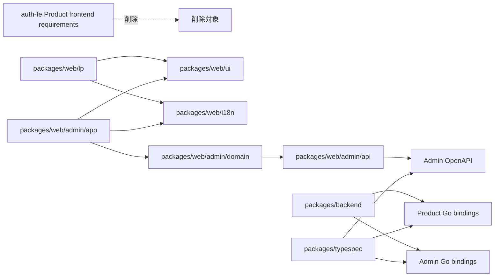
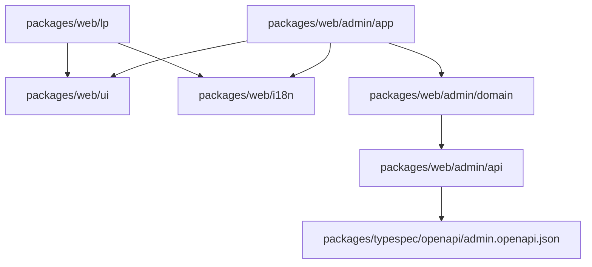
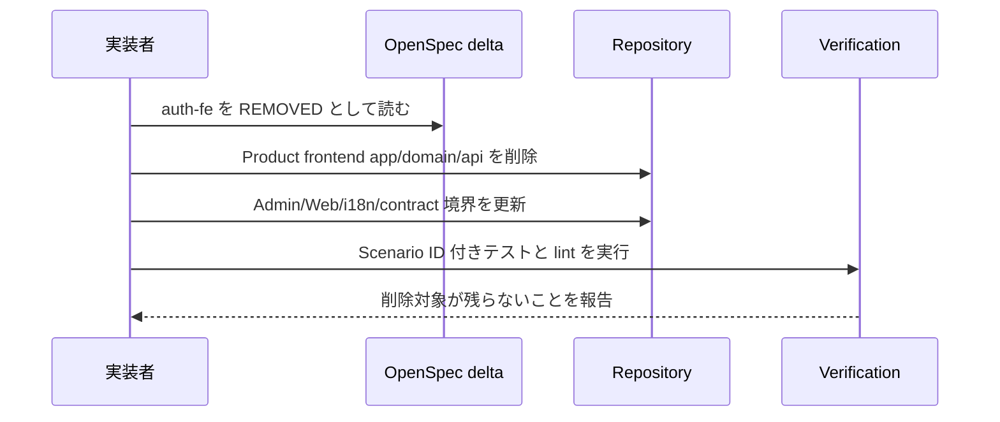
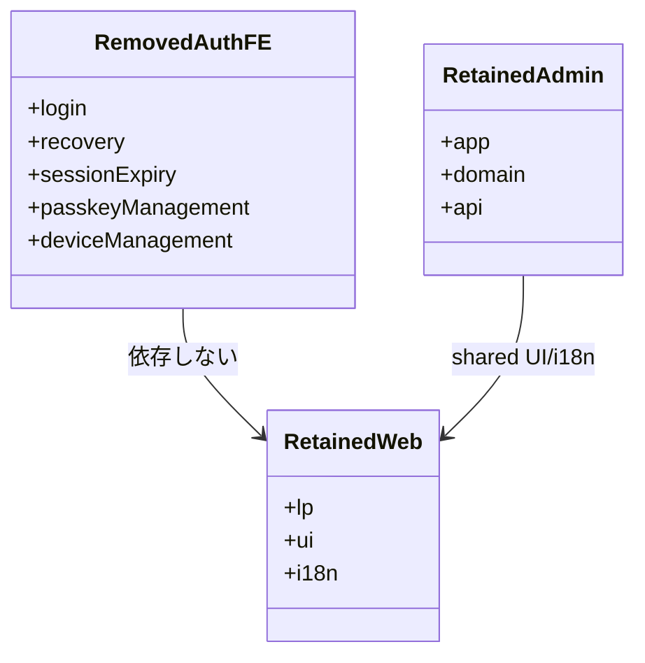
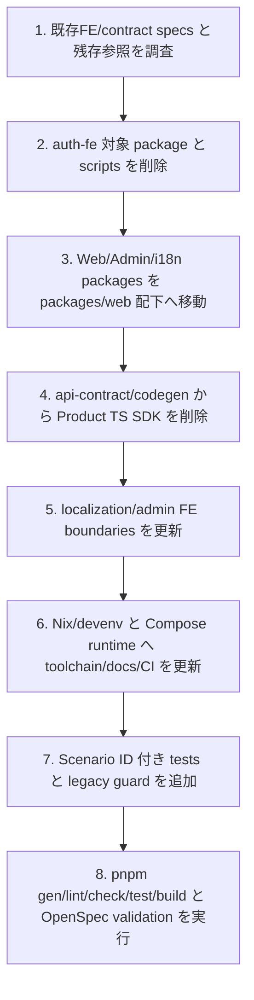

## Scope

### In Scope

- `auth-fe` の Product Svelte app 向け requirements を削除し、OpenSpec と repository から Product frontend app 前提を外す。
- `localization-fe` から認証済み Product app locale requirement を削除し、公開 Web LP / Admin Console / shared i18n 境界へ修正する。
- `api-contract-be` から Product TypeScript SDK 生成・検証を外し、Product OpenAPI/Go bindings と Admin OpenAPI/Admin SDK/Go bindings を維持する。
- `admin-console-fe` と `admin-auth-fe` の package path/import 境界を `packages/web/admin/*`、`@app-template/web-*` に修正する。
- Nix/devenv、Compose runtime、docs、CI、Zed、AGENTS、OpenCode 設定を、削除後の仕様境界に合わせる。

### Out of Scope

- Flutter app 本体、`packages/app`、root `pubspec.yaml`、Dart workspace、Flutter lint/test/build/CI は対象外。今回の仕様は、Flutter app を追加する前に Svelte app 時代のFE仕様を消すためのもの。
- Product frontend の認証UI、session UI、passkey UI、device management UI の移植は対象外。削除する仕様であり、別 package へ移植しない。
- Backend auth behavior の機能変更は対象外。Product API と Go bindings は残すが、Product TS SDK は残さない。

## Assumptions / Dependencies

- `openspec/specs/auth-fe/spec.md` は Product Svelte app の frontend requirements であり、`packages/frontend/app` / `packages/frontend/domain` / `packages/frontend/api` の削除と同時に delta で削除する。
- Admin Console は残すため、`admin-console-fe` と `admin-auth-fe` は削除せず package path/import 境界だけを修正する。
- 公開 Web と Admin locale は残すため、`localization-fe` は部分削除と境界修正にする。
- TypeSpec は引き続き source of truth とし、Product OpenAPI と Product Go bindings は残す。
- `openspec` CLI は現時点の PATH に存在しないため、実装時に Nix/devenv 導入後またはCLI利用可能環境で strict validation を実行する。

## Impacted Areas

- OpenSpec: `auth-fe`、`localization-fe`、`api-contract-be`、`admin-console-fe`、`admin-auth-fe`。
- Packages: `packages/frontend/app`、`packages/frontend/domain`、`packages/frontend/api`、`packages/frontend/ui`、`packages/frontend/i18n`、`packages/admin/*`、`packages/web/**`。
- Codegen: `packages/typespec`、`packages/web/admin/api`、`packages/backend/internal/generated/**`、`scripts/codegen/check.sh`。
- Tooling/docs: `package.json`、`pnpm-workspace.yaml`、`tsconfig.base.json`、`eslint.config.js`、`vitest.config.ts`、`playwright.config.ts`、`README.md`、`AGENTS.md`、`CONTRIBUTING.md`、`CODING_STANDARDS.md`、`.github/workflows/ci.yml`、`.zed/**`、`.opencode/**`。

## Directory Tree

```text
.
├─ flake.nix
├─ flake.lock
├─ devenv.nix
├─ devenv.yaml
├─ devenv.lock
├─ compose.yaml
├─ docker/
│  └─ runtime/
│     └─ Dockerfile
├─ compose/
│  └─ signoz/
├─ package.json
├─ pnpm-workspace.yaml
├─ tsconfig.base.json
├─ eslint.config.js
├─ vitest.config.ts
├─ playwright.config.ts
├─ README.md
├─ AGENTS.md
├─ CONTRIBUTING.md
├─ CODING_STANDARDS.md
├─ .github/
│  └─ workflows/
│     └─ ci.yml
├─ .zed/
├─ .opencode/
├─ scripts/
│  ├─ codegen/
│  ├─ i18n/
│  ├─ lint/
│  └─ security/
├─ packages/
│  ├─ web/
│  │  ├─ lp/
│  │  ├─ ui/
│  │  ├─ i18n/
│  │  └─ admin/
│  │     ├─ app/
│  │     ├─ api/
│  │     └─ domain/
│  ├─ backend/
│  └─ typespec/
└─ openspec/
   └─ changes/
      └─ prepare-flutter-app-template-foundation/
         ├─ proposal.md
         ├─ design.md
         ├─ tasks.md
         └─ specs/
            ├─ auth-fe/spec.md
            ├─ localization-fe/spec.md
            ├─ api-contract-be/spec.md
            ├─ admin-console-fe/spec.md
            └─ admin-auth-fe/spec.md
```

## New / Changed Files

| Type     | File                                                                  | Change                                                                                            |
| -------- | --------------------------------------------------------------------- | ------------------------------------------------------------------------------------------------- |
| Add      | `flake.nix`                                                           | Nix devShell を定義し、標準 toolchain の入口にする。                                              |
| Add      | `devenv.nix`                                                          | Node.js、pnpm、Go、TypeSpec、codegen、security、browser-test tooling を定義する。                 |
| Move/Add | `compose.yaml`                                                        | Dev Container 用ではなく infra/runtime Compose として root に置く。                               |
| Move/Add | `docker/runtime/Dockerfile`                                           | runtime service 用に配置し、toolchain の第二の正にしない。                                        |
| Delete   | `.devcontainer/**`                                                    | Dev Container 定義と post-create flow を削除する。                                                |
| Delete   | `scripts/devcontainer/run.sh`                                         | Dev Container wrapper を削除する。                                                                |
| Move     | `packages/web` -> `packages/web/lp`                                   | 公開 Web LP を supported Web tree に置く。                                                        |
| Move     | `packages/frontend/ui` -> `packages/web/ui`                           | shared UI package を移動する。                                                                    |
| Move     | `packages/frontend/i18n` -> `packages/web/i18n`                       | shared i18n runtime を移動する。                                                                  |
| Move     | `packages/admin/*` -> `packages/web/admin/*`                          | Admin app/domain/api を Web Admin tree に移動する。                                               |
| Delete   | `packages/frontend/app`                                               | `auth-fe` 削除に合わせて Product Svelte app を削除する。                                          |
| Delete   | `packages/frontend/domain`                                            | Product frontend domain を削除する。                                                              |
| Delete   | `packages/frontend/api`                                               | Product TypeScript SDK package を削除する。                                                       |
| Update   | `package.json`                                                        | Product app scripts と Product TS SDK generation を削除し、supported package scripts へ更新する。 |
| Update   | `pnpm-workspace.yaml`                                                 | supported packages のみ workspace member にし、security hardening 設定を維持する。                |
| Update   | `tsconfig.base.json`                                                  | `@app-template/web-*` aliases に更新し、Product frontend aliases を削除する。                     |
| Update   | `eslint.config.js`                                                    | `auth-fe` 削除後の package boundary と Admin/Web/i18n rules に更新する。                          |
| Update   | `vitest.config.ts`                                                    | Product frontend app project を削除し、LP/UI/Admin/root projects に整理する。                     |
| Update   | `playwright.config.ts`                                                | Product app dev server と 5174 前提を削除する。                                                   |
| Update   | `scripts/codegen/check.sh`                                            | Product TS SDK drift check を削除し、retained artifacts を検証する。                              |
| Update   | `scripts/i18n/check-locales.ts`                                       | Product app locale scan を削除し、LP/Admin/i18n paths に更新する。                                |
| Add      | `scripts/lint/no-legacy-paths.sh`                                     | 削除対象 path/scope/toolchain identifiers の混入を検出する。                                      |
| Update   | `README.md` / `AGENTS.md` / `CONTRIBUTING.md` / `CODING_STANDARDS.md` | 削除後の仕様境界、Nix/devenv、Web/Admin package tree に合わせる。                                 |
| Update   | `.github/workflows/ci.yml` / `.zed/**` / `.opencode/**`               | Dev Container と Product frontend app 前提を削除する。                                            |
| Update   | `openspec/changes/prepare-flutter-app-template-foundation/**`         | 既存Spec Unitの削除・修正deltaとして整える。                                                      |

## System Diagram



## Package Diagram



## Sequence Diagram



## UI Wireframes

N/A。wireframe は未生成。UI追加ではなく Product FE仕様削除と package boundary 修正であるため、画面ワイヤーは不要。

## Domain Model Diagram



## ER Diagram

```mermaid
erDiagram
  %% N/A: DB schema は変更しない。
```

## Package-Level Design

### Package List

| Package                     | Purpose / Responsibility                                     | Public API                   | Dependencies                                     |
| --------------------------- | ------------------------------------------------------------ | ---------------------------- | ------------------------------------------------ |
| `packages/web/lp`           | 公開 Web LP を所有する。                                     | SvelteKit app entry          | `@app-template/web-ui`, `@app-template/web-i18n` |
| `packages/web/ui`           | Web/Admin shared UI を所有する。                             | components/styles exports    | Svelte/TypeScript                                |
| `packages/web/i18n`         | Web/Admin shared i18n runtime を所有する。                   | translator/formatter exports | surface packages                                 |
| `packages/web/admin/app`    | Admin Console UI を所有する。                                | SvelteKit app entry          | `web-admin-domain`, `web-ui`, `web-i18n`         |
| `packages/web/admin/domain` | Admin UI state/API orchestration を所有する。                | hooks/facades                | `web-admin-api`                                  |
| `packages/web/admin/api`    | Admin TS SDK を所有する。                                    | generated client exports     | Admin OpenAPI                                    |
| `packages/typespec`         | Product/Admin API contract を所有する。                      | OpenAPI generation           | TypeSpec compiler                                |
| `packages/backend`          | Product/Admin Go API と Go bindings consumption を所有する。 | Go binaries                  | generated Go bindings                            |

### Details

#### `auth-fe`

- Purpose / Responsibility: Product Svelte app のFE仕様削除を表す。実装 package は残さない。
- Public API: N/A。削除対象であり public FE API を提供しない。
- Key Data Structures: 削除対象 package paths、REMOVED requirements、legacy identifier guard patterns。
- Key Flows: spec削除確認 -> package削除 -> scripts/codegen/lint/test削除 -> guardで残存確認。
- Dependencies: backend/API specs は残すが、Product TS SDK には依存しない。
- Error Handling: 削除対象参照が残る場合は lint/grep guard で失敗させる。
- Testing Strategy: `AUTH-FE-*` の削除確認を legacy path guard、workspace scan、script scan で検証する。
- Non-Functional: 不要なFE仕様を残さず、将来Flutter app仕様と混同しない。
- Performance: Product app dev/build/test を標準検証から削除する。
- Security: Product frontend token/session UI を削除し、secret handling は backend/Admin/将来app仕様へ閉じる。

#### Admin/Web packages

- Purpose / Responsibility: 残す frontend surface を `packages/web/**` に集約する。
- Public API: `@app-template/web-lp`、`@app-template/web-ui`、`@app-template/web-i18n`、`@app-template/web-admin-app`、`@app-template/web-admin-domain`、`@app-template/web-admin-api`。
- Key Data Structures: package manifests、tsconfig aliases、ESLint boundaries、locale JSON。
- Key Flows: LP/Admin app -> shared UI/i18n、Admin app -> Admin domain -> Admin API。
- Dependencies: SvelteKit、Vite、Vitest、Admin OpenAPI SDK。
- Error Handling: direct SDK import、server-only module、i18n boundary violation は lint で失敗する。
- Testing Strategy: `LOCALIZATION-FE-S010`、`LOCALIZATION-FE-S011`、`LOCALIZATION-FE-S013`、`ADMIN-CONSOLE-FE-S038`、`ADMIN-CONSOLE-FE-S039`、`ADMIN-CONSOLE-FE-S040`、`ADMIN-AUTH-FE-S027`、`ADMIN-AUTH-FE-S028`、`ADMIN-AUTH-FE-S033`、`ADMIN-AUTH-FE-S012` から `ADMIN-AUTH-FE-S016` を更新テストで確認する。
- Non-Functional: shared UI は表示言語を所有しない。
- Performance: 存在しない Product app server を起動しない。
- Security: Admin API boundary と no-BFF/no-server-only policy を維持する。

#### Contract/codegen

- Purpose / Responsibility: Product TS SDKを外し、retained generated artifacts の分離を守る。
- Public API: `pnpm gen`、`pnpm check:codegen`、Product/Admin OpenAPI、Product/Admin Go bindings、Admin TS SDK。
- Key Data Structures: TypeSpec services、OpenAPI JSON、generated Go files、Admin generated client。
- Key Flows: TypeSpec compile -> OpenAPI generation -> Admin SDK generation -> Go bindings generation -> drift check。
- Dependencies: TypeSpec、orval、oapi-codegen、prettier。
- Error Handling: Product TS SDK path を要求した場合は test/guard で失敗させる。
- Testing Strategy: `API-CONTRACT-BE-S001`、`API-CONTRACT-BE-S002`、`API-CONTRACT-BE-S003`、`API-CONTRACT-BE-S006` から `API-CONTRACT-BE-S009` を codegen/lint tests で確認する。
- Non-Functional: 生成物の surface isolation を維持する。
- Performance: 不要な Product TS SDK generation を削除する。
- Security: Admin operation が Product artifacts に混入しないことを維持する。

## Implementation Plan



## Test Plan

### User Acceptance Test (Manual)

| UAT ID                      | Related Requirement                | Spec Summary                             | Customer Problem Summary                                        | Steps                                                           | Expected Behavior                                                                  |
| --------------------------- | ---------------------------------- | ---------------------------------------- | --------------------------------------------------------------- | --------------------------------------------------------------- | ---------------------------------------------------------------------------------- |
| UAT-AUTH-FE-REG-001         | AUTH-FE removed requirements       | Product Svelte app FE仕様が削除される。  | Flutter基盤にSvelte app認証仕様が残ると後続実装が誤誘導される。 | repository tree、workspace、scripts、docs、OpenSpecを確認する。 | Product frontend app/domain/api と `auth-fe` 要求が active target として残らない。 |
| UAT-LOCALIZATION-FE-HAP-001 | LOCALIZATION-FE-S010 / S011 / S013 | locale対象が公開WebとAdminに限定される。 | 存在しないProduct app locale scanで検証が壊れる。               | i18n coverage と ESLint を実行する。                            | LP/Admin/i18nだけが検査され、shared UI はi18n runtimeに依存しない。                |
| UAT-API-CONTRACT-BE-HAP-001 | API-CONTRACT-BE-S001 / S006 / S009 | Product TS SDK が生成・検証されない。    | 削除済みfrontend packageの再作成を避ける。                      | `pnpm gen` と `pnpm check:codegen` を実行する。                 | Product OpenAPI/Go bindings、Admin OpenAPI/Admin SDK/Go bindingsだけが検証される。 |

### E2E Test (Playwright)

| E2E ID                    | Playwright Test Name                                                         | Related Scenario   | Category | Summary                                                   | Steps (Playwright)                                                 | Expected Behavior                                   |
| ------------------------- | ---------------------------------------------------------------------------- | ------------------ | -------- | --------------------------------------------------------- | ------------------------------------------------------------------ | --------------------------------------------------- |
| E2E-AUTH-FE-REG-001       | `[AUTH-FE-S001] Product Svelte login server is absent from Playwright setup` | AUTH-FE-S001       | REG      | 削除されたProduct login surfaceをPlaywrightが起動しない。 | Playwright webServer config を起動し、LP/Admin必要分だけ確認する。 | Product app host/5174 を起動しない。                |
| E2E-ADMIN-AUTH-FE-HAP-001 | `[ADMIN-AUTH-FE-S027] Login UI calls Admin backend through Admin api layer`  | ADMIN-AUTH-FE-S027 | HAP      | Admin loginは残すが package境界を新pathにする。           | Admin login flow のmock/API boundaryを確認する。                   | Admin domain/api layer経由でsame-origin APIを呼ぶ。 |

### Integration Test (Endpoint)

| IT ID                       | Test Name                                                                                | Genre | Category | Summary                                     | Steps (Test)                                                             | Expected Behavior                                             |
| --------------------------- | ---------------------------------------------------------------------------------------- | ----- | -------- | ------------------------------------------- | ------------------------------------------------------------------------ | ------------------------------------------------------------- |
| IT-API-CONTRACT-BE-HAP-001  | `[API-CONTRACT-BE-S001] Product generation excludes Admin operations and Product TS SDK` | be    | HAP      | Product artifact境界を検証する。            | `pnpm gen` 後に Product OpenAPI/Go bindings と package tree を確認する。 | Admin operationとProduct TS SDK packageが存在しない。         |
| IT-API-CONTRACT-BE-REG-002  | `[API-CONTRACT-BE-S006] Drift check validates retained artifacts only`                   | be    | REG      | codegen drift check対象を確認する。         | `pnpm check:codegen` を実行する。                                        | retained artifactsだけを検証する。                            |
| IT-ADMIN-CONSOLE-FE-SEC-001 | `[ADMIN-CONSOLE-FE-S039] Admin package rejects server-only modules`                      | fe    | SEC      | Admin frontendのserver-only混入を拒否する。 | lintを実行する。                                                         | `packages/web/admin` のserver-only moduleを検出して失敗する。 |

### Unit/Component Test (UT)

| UT ID                       | Test Name                                                                       | Package                | Category | Summary                                         | Steps (Test)                                            | Expected Behavior                                                                           |
| --------------------------- | ------------------------------------------------------------------------------- | ---------------------- | -------- | ----------------------------------------------- | ------------------------------------------------------- | ------------------------------------------------------------------------------------------- |
| UT-AUTH-FE-REG-001          | `[AUTH-FE-S001] Product frontend app package is not a workspace member`         | root                   | REG      | Product FE削除を確認する。                      | workspace/package tree scanを追加する。                 | `packages/frontend/app`、`packages/frontend/domain`、`packages/frontend/api` が存在しない。 |
| UT-AUTH-FE-REG-002          | `[AUTH-FE-S010] Product passkey management UI references are absent`            | root                   | REG      | Product passkey UI仕様の残存参照を検出する。    | grep/AST guardを追加する。                              | Product app passkey management UI参照がない。                                               |
| UT-LOCALIZATION-FE-REG-001  | `[LOCALIZATION-FE-S010] Locale coverage scans LP and Admin only`                | root/i18n              | REG      | locale coverage targetを確認する。              | `scripts/i18n/check-locales.ts` のunit testを更新する。 | LP/Admin locale key差分だけを検出する。                                                     |
| UT-LOCALIZATION-FE-SEC-002  | `[LOCALIZATION-FE-S011] Shared UI cannot import web i18n runtime`               | root/eslint            | SEC      | shared UIのi18n非依存を確認する。               | ESLint fixture/testを追加する。                         | `packages/web/ui` から `@app-template/web-i18n` importで失敗する。                          |
| UT-LOCALIZATION-FE-REG-003  | `[LOCALIZATION-FE-S013] Localized concrete components stay in surfaces`         | root/eslint            | REG      | concrete localized componentsの配置を確認する。 | lint/fixture testを追加する。                           | concrete localized componentがLP/Admin所有になる。                                          |
| UT-API-CONTRACT-BE-REG-001  | `[API-CONTRACT-BE-S009] Admin SDK stays inside web admin api boundary`          | root/eslint            | REG      | SDK package boundaryを確認する。                | ESLint boundary testを追加する。                        | LP/UIからAdmin SDK importで失敗する。                                                       |
| UT-ADMIN-CONSOLE-FE-SEC-001 | `[ADMIN-CONSOLE-FE-S038] Admin app cannot import generated API client directly` | root/eslint            | SEC      | Admin app -> domain -> api境界を確認する。      | ESLint fixture/testを更新する。                         | appからapi direct importで失敗する。                                                        |
| UT-ADMIN-CONSOLE-FE-HAP-002 | `[ADMIN-CONSOLE-FE-S040] Admin domain uses Admin api layer`                     | root/eslint            | HAP      | Admin domain/API境界を確認する。                | import graph testを追加する。                           | Admin domainが`packages/web/admin/api`経由になる。                                          |
| UT-ADMIN-AUTH-FE-HAP-001    | `[ADMIN-AUTH-FE-S012] Admin passkey list remains on admin surface`              | packages/web/admin/app | HAP      | Admin passkey UIは残す。                        | component/domain testを移動後pathで実行する。           | operator passkey一覧がAdmin surfaceで検証される。                                           |
| UT-ADMIN-AUTH-FE-SEC-002    | `[ADMIN-AUTH-FE-S028] Product auth SDK is not used for operator session`        | root/eslint            | SEC      | Admin authがProduct SDKへ依存しない。           | lint fixture/testを更新する。                           | Product SDK importで失敗する。                                                              |

## Rollback / Migration

- Rollback: package削除とSpec削除を含むため、PR単位で revert する。DB migration は発生しない。
- Migration: `auth-fe` は archive後のmain specから削除される想定。Admin/Web/i18n/contract specs は modified delta をmain specへ反映する。
- Compatibility: symlink、旧package名、旧path alias、旧script wrapperは作らない。

## Release Procedure

- `nix flake check` を実行する。
- `nix develop --command pnpm install --frozen-lockfile` を実行する。lockfile更新が必要な場合は hardening 設定を維持したまま `nix develop --command pnpm install` を実行する。
- `nix develop --command pnpm gen` を実行する。
- `nix develop --command pnpm format:check` を実行する。
- `nix develop --command pnpm lint` を実行する。
- `nix develop --command pnpm check` を実行する。
- `nix develop --command pnpm test:run` を実行する。
- `nix develop --command pnpm test:e2e` を実行する。
- `nix develop --command pnpm build` を実行する。
- `openspec validate "prepare-flutter-app-template-foundation" --type change --strict --no-interactive` を実行できる環境で実行する。

## Acceptance Criteria

- `auth-fe` delta は Product Svelte app 向け requirements を `REMOVED` として扱う。
- Product frontend app/domain/api package、Product TS SDK generation、5174/app host、Dev Container wrapper が active surface から消える。
- `localization-fe`、`admin-console-fe`、`admin-auth-fe`、`api-contract-be` は retained Web/Admin/backend surfaces に合う。
- すべての自動検証タスクは関連 Scenario ID を test title に含める。
- Flutter app 本体とFlutter標準検証は追加されない。

## Open Issues

- N/A。ユーザー指摘に基づき、新規Spec Unitではなく既存FE/contract specの削除・修正として再構成した。
